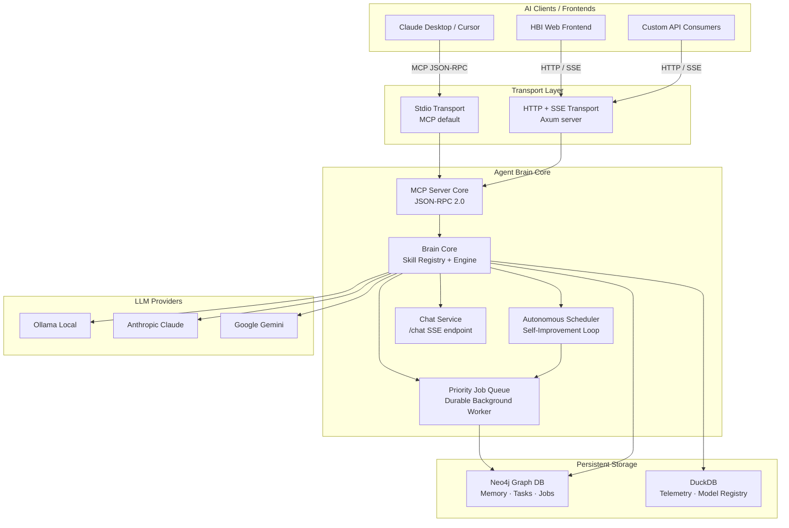
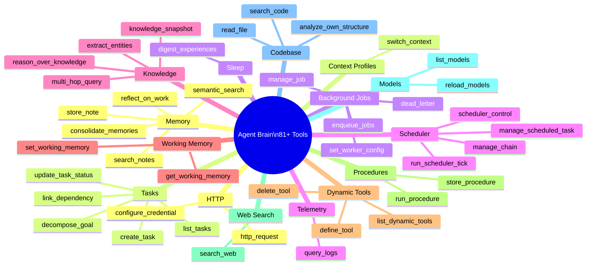
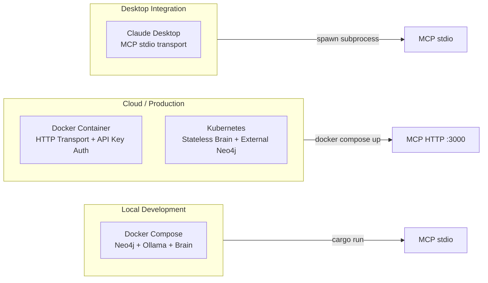

# Agent Brain — Stakeholder Overview

## What Is Agent Brain?

Agent Brain is a **persistent, autonomous AI memory and reasoning engine** built as a
[Model Context Protocol (MCP)](https://modelcontextprotocol.io) server. It gives any MCP-compatible
AI assistant (Claude, Cursor, custom agents) a durable long-term memory, a goal-tracking system,
a self-improving background scheduler, and a pluggable multi-provider LLM backend — all backed by a
Neo4j knowledge graph.

Think of it as the **cognitive infrastructure layer** that sits behind an AI assistant and makes it
capable of remembering, planning, reasoning, and improving over time.

---

## Core Value Propositions

| Capability | What It Means |
|------------|---------------|
| **Persistent Memory** | Notes, facts, and experiences survive across sessions. No more "cold start" amnesia. |
| **Semantic + Keyword Search** | Hybrid vector (cosine) + BM25 retrieval surfaces the right knowledge even with imprecise queries. |
| **Goal Tracking** | Tasks with measurable success criteria. Sub-tasks, dependencies, automatic re-dispatch on failure. |
| **Background Autonomy** | A scheduler continuously works through pending tasks without human prompting. |
| **Self-Improvement** | After idle periods the brain consolidates memories, prunes stale notes, and reflects on its own performance. |
| **Multi-Provider LLM** | Ollama (local), Anthropic Claude, Google Gemini, or any OpenAI-compatible endpoint. Switch per workload. |
| **Pluggable Tools** | 81+ built-in tools across 15 skill domains. New tools can be defined at runtime via natural language. |

---

## System at a Glance

---

## The Skill Domains

Agent Brain exposes **81+ tools** organized into 15 skill domains that any connected AI client can call.

---

## Who Uses It?

| User / System | How They Interact | What They Get |
|---------------|------------------|---------------|
| **AI Assistant** (Claude, GPT, etc.) | MCP tool calls | Persistent memory, task management, background work |
| **Developer** | HTTP REST / SSE | Direct API access, custom integrations |
| **HBI Frontend** | WebSocket + SSE | Visual dashboard: chat, knowledge graph, task board |
| **Autonomous Scheduler** | Internal job queue | Self-directed task execution without human prompting |
| **Other MCP Servers** | Chained MCP calls | Composable agent networks |

---

## Deployment Options

**Minimum Requirements**
- Rust 2024 edition toolchain
- Neo4j 5.x (graph storage)
- One LLM provider: Ollama (local, free) or an Anthropic/Gemini API key
