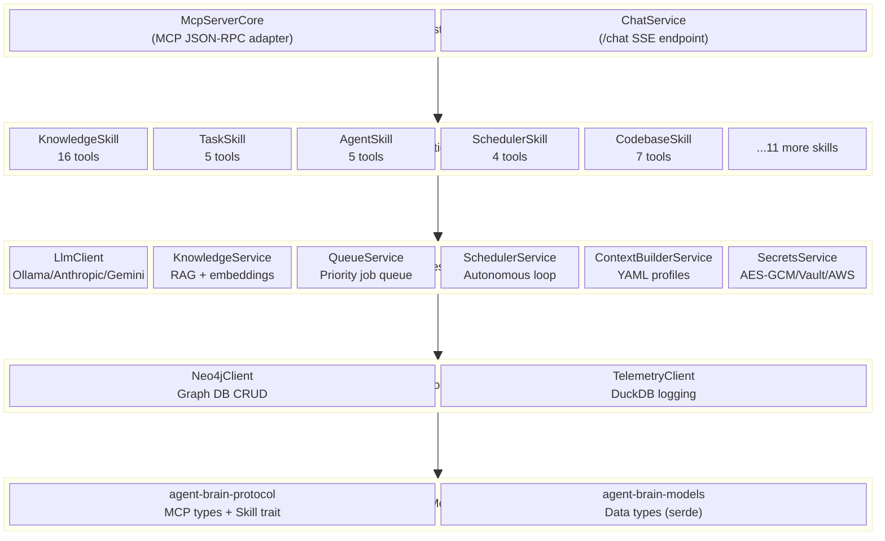
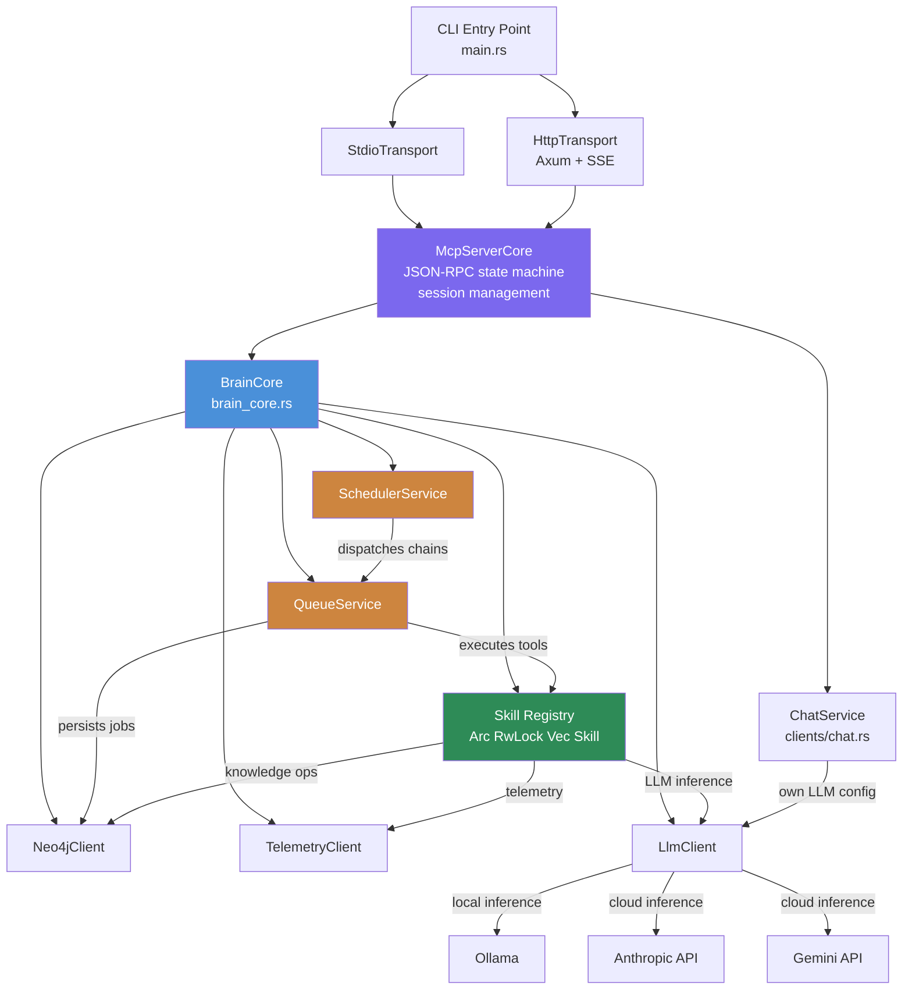
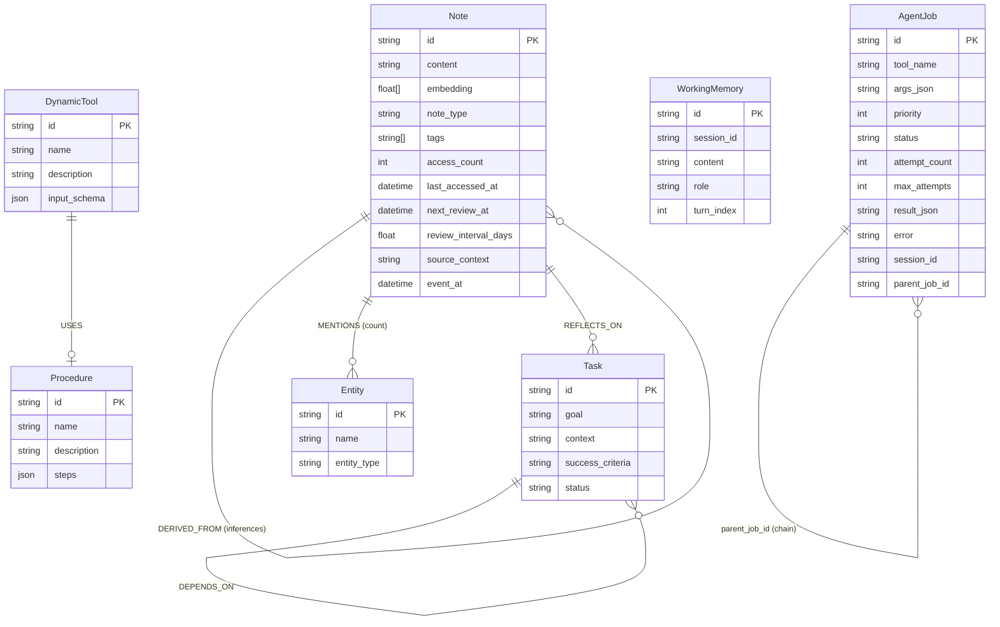
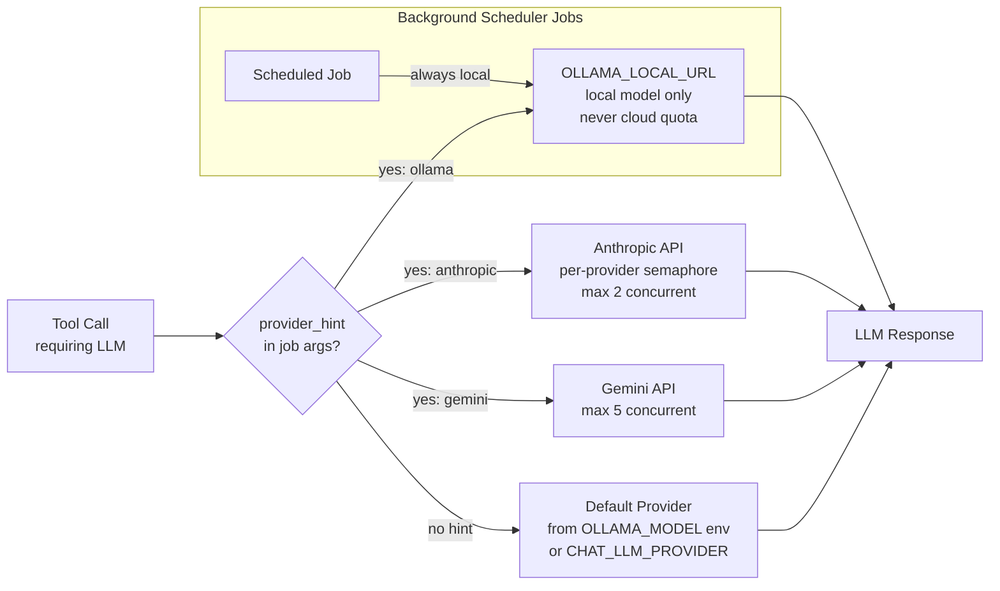
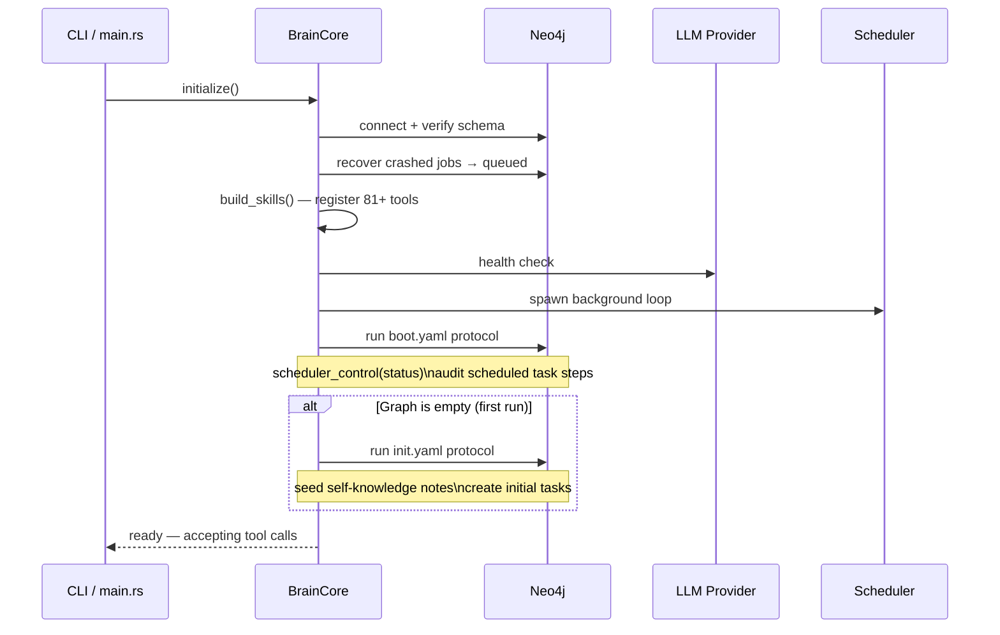
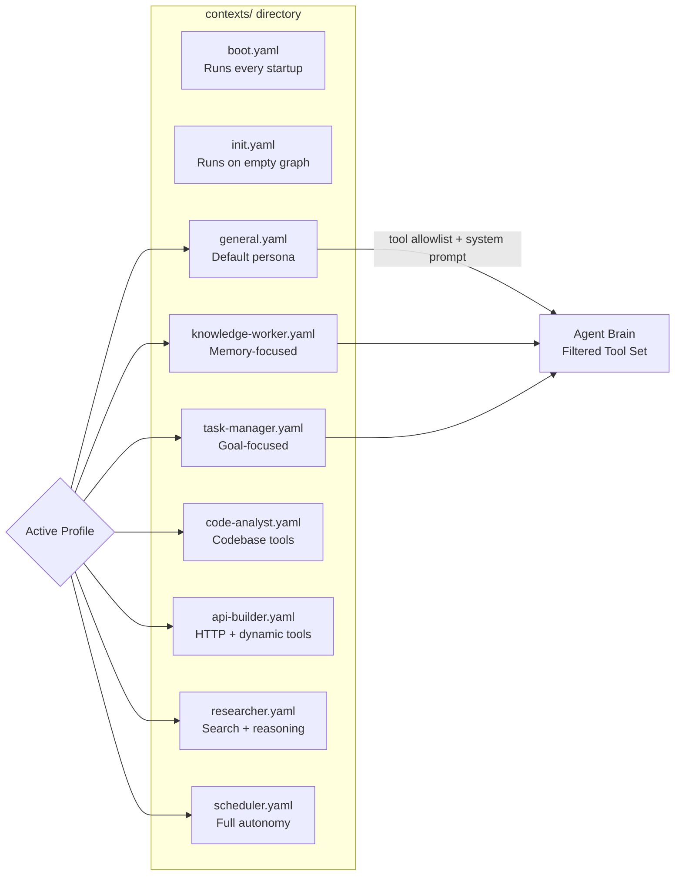

# Agent Brain — Architecture Deep Dive

## Layered Architecture

Agent Brain is organized as a **four-crate Cargo workspace** with strict dependency layering.
Each layer only depends on layers below it, making every component independently testable
and replaceable.

---

## Component Interaction Map

---

## Neo4j Knowledge Graph Schema

The graph database is the **single source of truth** for all persistent state.

---

## LLM Provider Routing

---

## Startup Initialization Sequence

---

## Context Profiles

Context profiles are YAML files that let operators configure **which tools are available**
and **what system prompt** is used for a given persona or use case.

Each profile defines:
- `allowed_tools` — allowlist of tool names the LLM can see
- `system_prompt` — persona/task framing text
- `token_budget` — optional context window constraint
