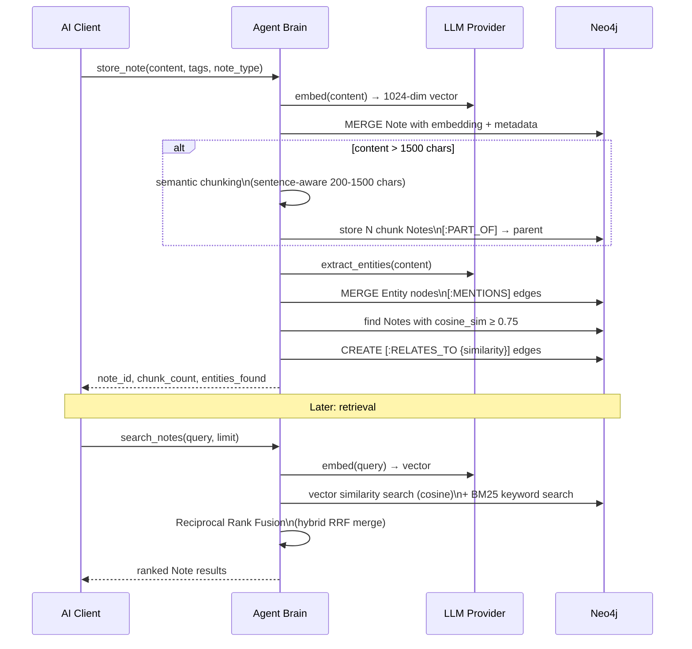
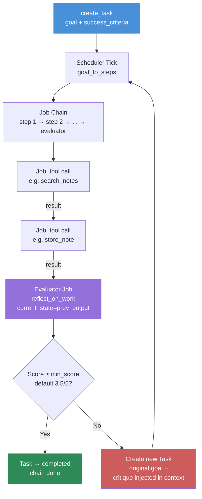
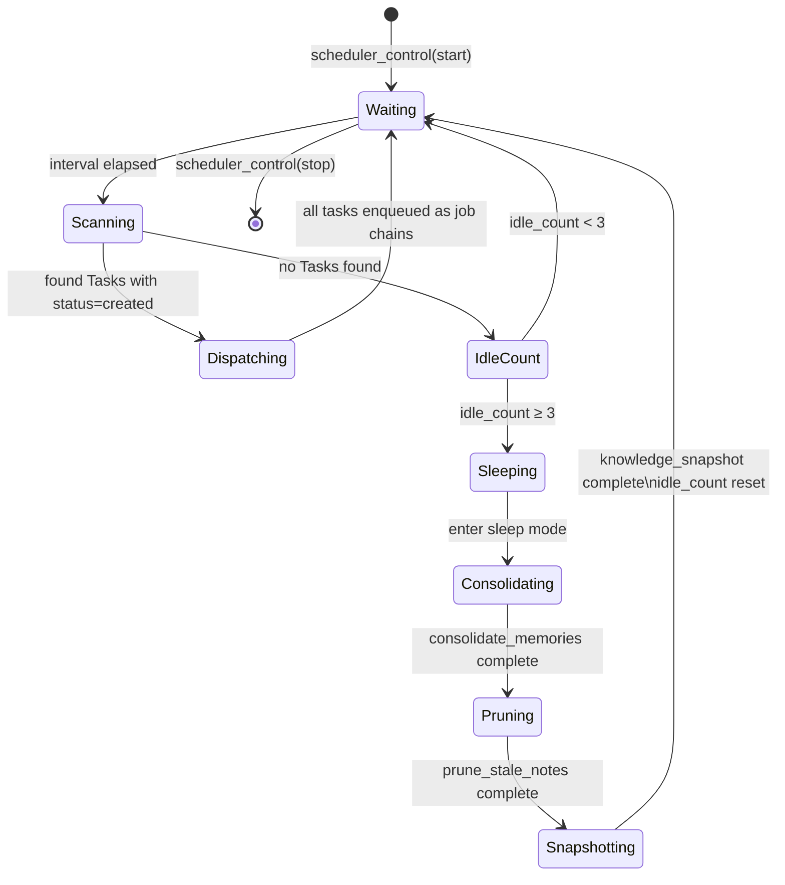
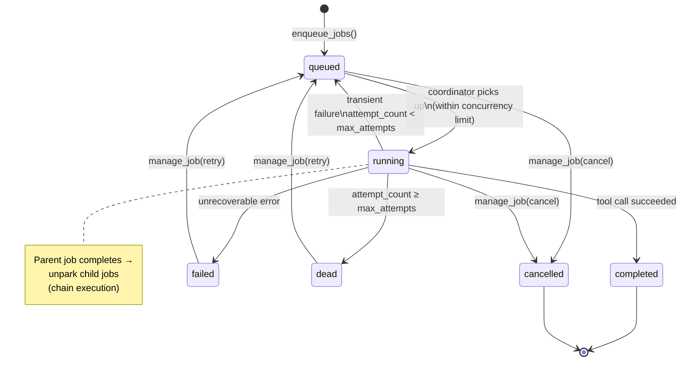
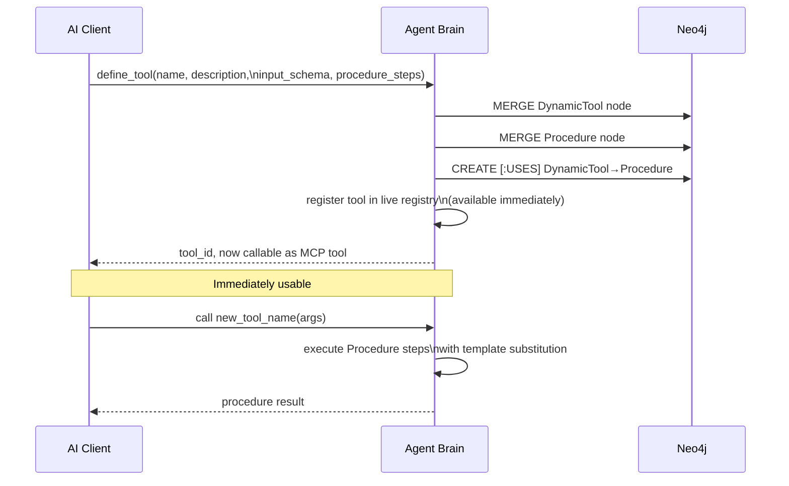

# Agent Brain — Core Workflows

## 1. Memory Storage & Retrieval

The most fundamental workflow: storing a piece of knowledge and later retrieving it
with semantic understanding.



---

## 2. Goal Execution with Evaluator Loop

When a task has `success_criteria`, the scheduler automatically appends an evaluator step
that grades the output and re-dispatches if quality is insufficient.



---

## 3. Autonomous Scheduler Loop

The scheduler runs every `SCHEDULER_INTERVAL_SECS` (default 5 min) without any human prompting.



**Sleep Mode Triggers:**
- 3 consecutive ticks with no new tasks dispatched
- Manually via `scheduler_control(action=stop)`

**Sleep Sequence Jobs:**
1. `consolidate_memories` — LLM summarizes overdue/abundant episodic notes
2. `prune_stale_notes` — removes notes not accessed in 30+ days
3. `knowledge_snapshot` — stores a reflection note summarizing the session

---

## 4. Background Job Queue Lifecycle

Every action the scheduler dispatches runs as a durable `AgentJob` in the priority queue.



**Priority Levels:**
| Level | Value | Use Case |
|-------|-------|----------|
| Critical | 0 | Immediate execution (e.g., error recovery) |
| High | 1 | User-initiated tasks |
| Normal | 2 | Scheduler-dispatched work |
| Low | 3 | Background maintenance |

---

## 5. Memory Consolidation (Spaced Repetition)

Agent Brain implements a spaced repetition system for long-term memory health.

```mermaid
flowchart TD
    TRIGGER{Consolidation\nTrigger} -->|≥10 overdue notes\nOR ≥50 episodic notes| GATHER

    GATHER[Gather candidate notes\nnext_review_at ≤ now\nor note_type=episodic]
    GATHER --> GROUP[Group by semantic\nsimilarity clusters]
    GROUP --> LLM_CONS[LLM: synthesize\ngroup → 1 consolidated note]
    LLM_CONS --> STORE[Store consolidated Note\nnote_type=consolidated\n[:SUMMARIZED_BY] edges]
    STORE --> UPDATE[Update source notes\nnext_review_at = now + 30 days\nreview_interval_days += 5]
    UPDATE --> DONE[Memory footprint reduced\nKnowledge preserved]

    style TRIGGER fill:#cd853f,color:#fff
    style LLM_CONS fill:#9370db,color:#fff
    style DONE fill:#2e8b57,color:#fff
```

---

## 6. Dynamic Tool Creation

New tools can be defined at runtime without recompiling, using natural language descriptions.



---

## 7. Multi-Hop Knowledge Reasoning

For complex questions, Agent Brain can traverse multiple relationship hops in the graph.

```mermaid
graph LR
    Q[Query:\n'What projects use\nRust async?']
    Q --> EMBED[Vector embed query]
    EMBED --> TOP5[Top-5 similar notes\nby cosine + BM25]
    TOP5 --> ENTITY[Extract entities\nfrom results]
    ENTITY --> HOP1[Hop 1: notes\n[:MENTIONS] entity='Rust']
    HOP1 --> HOP2[Hop 2: notes\n[:RELATES_TO] Rust notes]
    HOP2 --> HOP3[Hop 3: tasks\n[:REFLECTS_ON] related notes]
    HOP3 --> FUSE[RRF fusion\nre-rank all candidates]
    FUSE --> LLM_R[LLM: synthesize\nfinal answer from\ntop-K context]
    LLM_R --> ANS[Reasoned Answer\nwith source citations]

    style Q fill:#4a90d9,color:#fff
    style ANS fill:#2e8b57,color:#fff
    style LLM_R fill:#9370db,color:#fff
```
