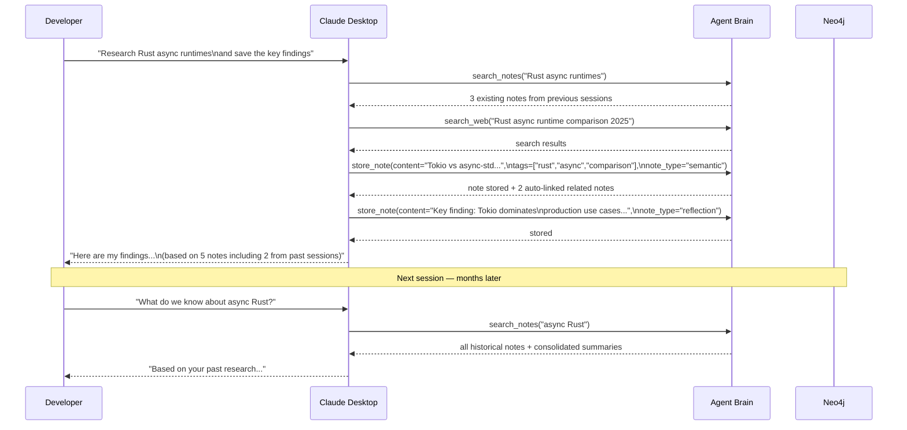
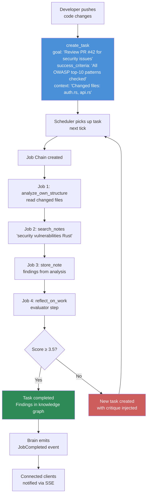
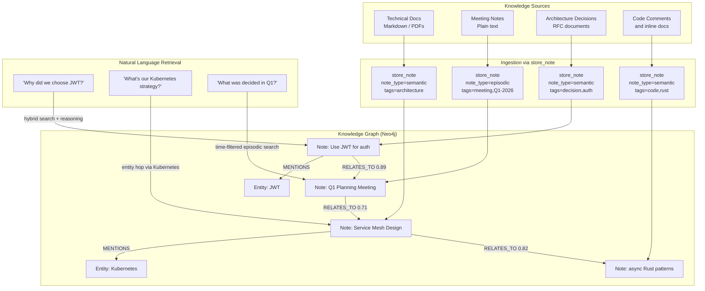
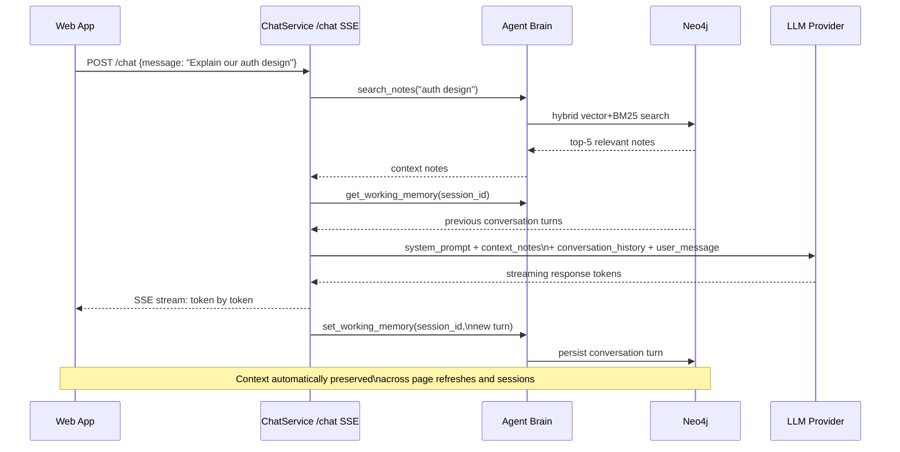
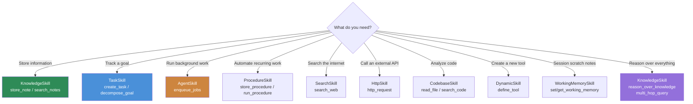

# Agent Brain — Use Case Examples

## Use Case 1: AI Research Assistant with Persistent Memory

**Scenario:** A developer uses Claude Desktop with Agent Brain as an MCP server.
Every research session builds on previous ones — no more re-explaining context.



---

## Use Case 2: Automated Code Review Pipeline

**Scenario:** Agent Brain runs as a background service. When a developer pushes code,
a task is created and the scheduler automatically reviews it and stores findings.



---

## Use Case 3: Knowledge Base Builder for an Engineering Team

**Scenario:** A team uses Agent Brain as a shared knowledge repository. It ingests
documentation, meeting notes, and decisions over time and makes them all searchable.



---

## Use Case 4: Autonomous Task Agent (No Human Prompting)

**Scenario:** Agent Brain runs fully autonomously. You give it goals; it works through
them on its own schedule, evaluates its own output, and improves on failure.

```mermaid
gantt
    title Autonomous Agent — 24 Hour Timeline
    dateFormat HH:mm
    axisFormat %H:%M

    section Task Dispatch
    Scan for pending tasks       :active, 00:00, 5m
    Dispatch 3 research tasks    :active, 00:05, 10m
    Scan (idle)                  :05:00, 5m
    Scan (idle)                  :10:00, 5m
    Scan — enters sleep mode     :15:00, 5m

    section Background Work
    Research Task 1 (job chain)  :00:05, 45m
    Research Task 2 (job chain)  :00:10, 60m
    Evaluator — Task 2 fails     :01:10, 5m
    Re-dispatch Task 2 improved  :06:00, 45m
    Research Task 3 (job chain)  :00:15, 30m

    section Sleep Cycle
    consolidate_memories         :15:05, 15m
    prune_stale_notes            :15:20, 10m
    knowledge_snapshot           :15:30, 5m

    section Next Cycle
    Scan — new tasks available   :18:00, 5m
    Dispatch new work            :18:05, 30m
```



---

## Use Case 5: Multi-Step Procedure Execution

**Scenario:** A recurring workflow (e.g., daily standup prep) is stored as a Procedure
and can be triggered by name.

```mermaid
flowchart TD
    STORE["store_procedure(\n  name='daily-standup-prep',\n  steps=(\n    search_notes yesterday's work,\n    search_notes blockers,\n    search_notes planned tasks,\n    store_note summary\n  )\n)"]

    TRIGGER[run_procedure\n'daily-standup-prep'\nargs={date: '2026-05-01'}]
    TRIGGER --> S1["Step 1: search_notes\ncompleted work on date-1"]
    S1 --> S2[Step 2: search_notes\nblockers issues problems]
    S2 --> S3[Step 3: list_tasks\nstatus=in_progress]
    S3 --> S4["Step 4: store_note\nStandup summary\nnote_type=episodic"]
    S4 --> DONE[Standup prep note\nstored in knowledge graph]

    STORE -.->|defines| TRIGGER

    style STORE fill:#4a90d9,color:#fff
    style DONE fill:#2e8b57,color:#fff
```

---

## Use Case 6: LLM-Backed Chat with Persistent Context

**Scenario:** A web application embeds the `/chat` SSE endpoint.
The conversation is grounded in the knowledge graph automatically.



---

## Decision Matrix: When to Use Which Skill


