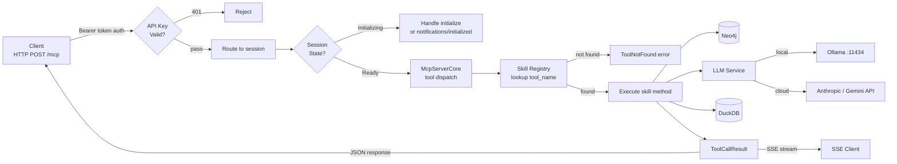
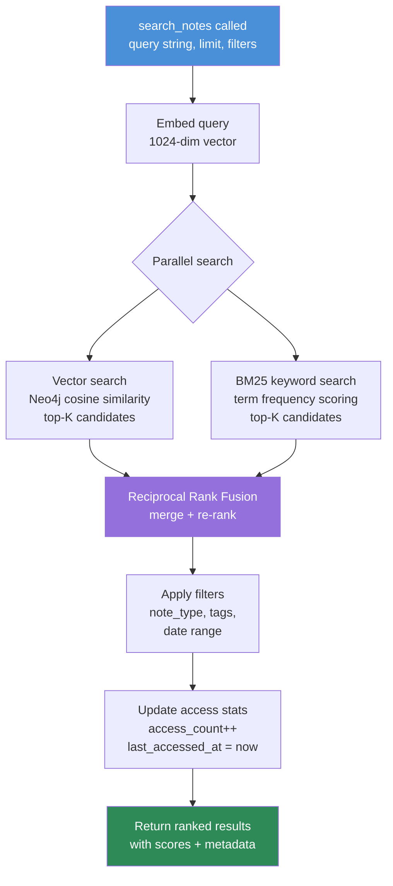
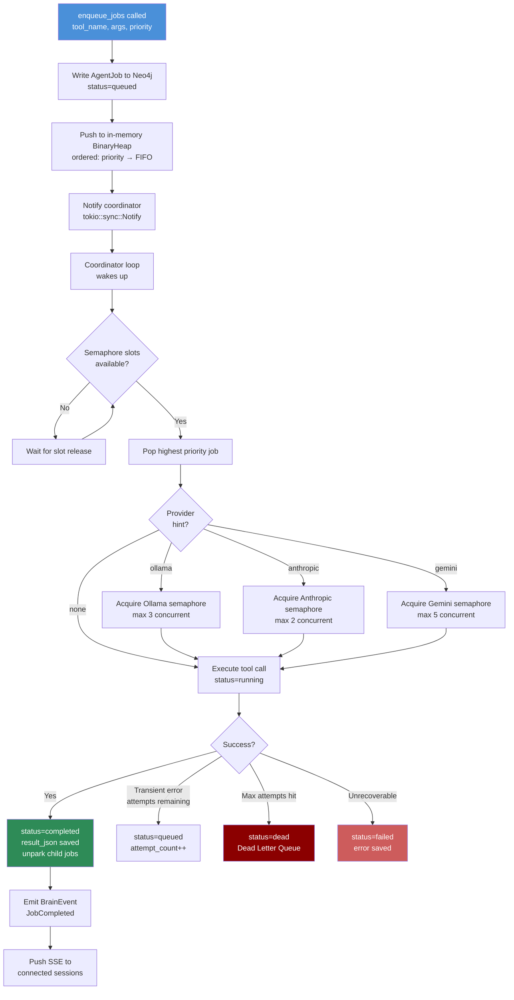
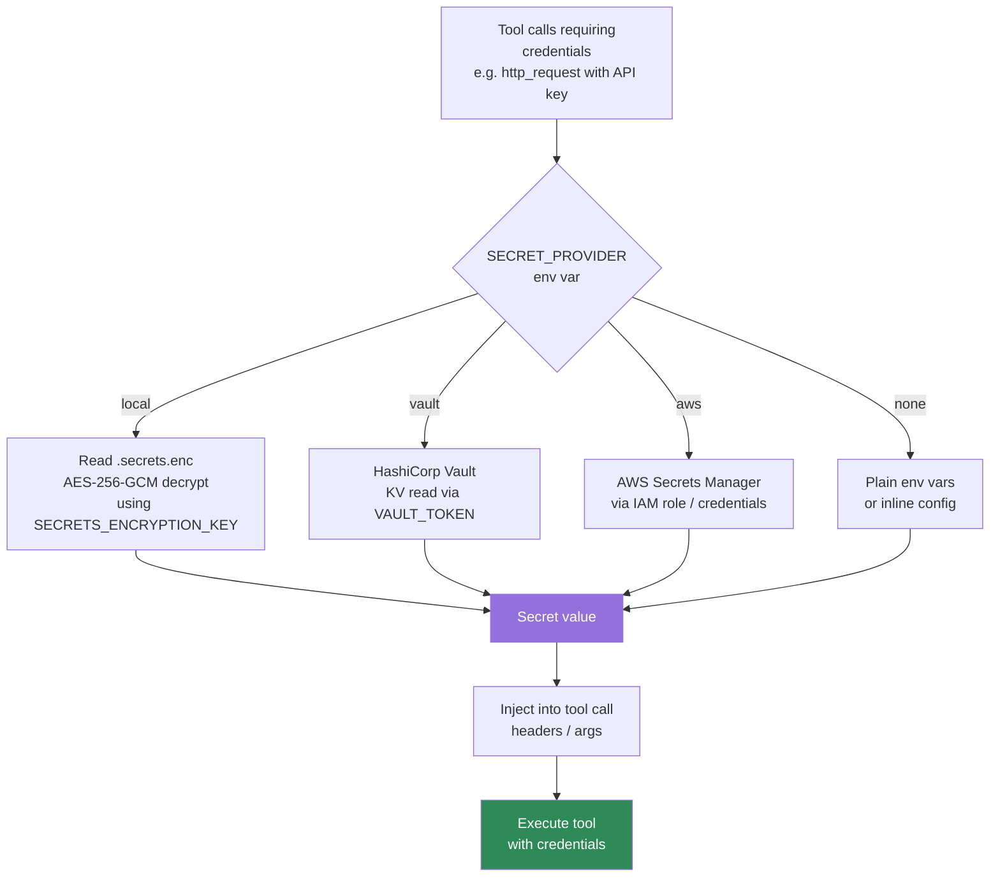

# Agent Brain — Data Flows

## End-to-End Request Flow (HTTP Transport)



---

## Memory Write Path (store_note)

```mermaid
flowchart TD
    INPUT[store_note called\ncontent, tags, note_type]

    INPUT --> SIZE{content\n> 1500 chars?}

    SIZE -->|Yes| CHUNK[Semantic chunker\nsentence-boundary split\n200-1500 chars per chunk]
    CHUNK --> EMBED_EACH[Embed each chunk\nOllama bge-m3 → 1024-dim]
    EMBED_EACH --> STORE_CHUNKS[Store N chunk Notes\n[:PART_OF] → parent]

    SIZE -->|No| EMBED_SINGLE[Embed content\n1024-dim vector]
    EMBED_SINGLE --> STORE_NOTE[MERGE Note\nembedding + metadata]

    STORE_CHUNKS --> ENTITY_EXT
    STORE_NOTE --> ENTITY_EXT

    ENTITY_EXT[LLM: extract entities\nperson / tool / technology\nconcept / org / url / date]
    ENTITY_EXT --> MERGE_ENT[MERGE Entity nodes\nCREATE :MENTIONS edges\nwith count]

    MERGE_ENT --> SIM_QUERY[Query: find Notes\ncosine_sim ≥ 0.75]
    SIM_QUERY --> REL_EDGES[CREATE :RELATES_TO edges\nfor each similar Note]

    REL_EDGES --> RETURN[Return: note_id\nchunk_count, entities, links]

    style INPUT fill:#4a90d9,color:#fff
    style RETURN fill:#2e8b57,color:#fff
```

---

## Memory Read Path (search_notes)



---

## Job Execution Flow (QueueService Coordinator)



---

## Secret Resolution Flow



---

## Scheduler Chain Building (goal_to_steps)

```mermaid
flowchart TD
    TASK[Task: goal + context\n+ optional success_criteria]

    TASK --> ANALYZE[LLM: analyze goal\nidentify required tools]
    ANALYZE --> STEPS[Generate ChainStep list\n[tool_name, args_template, ...]]

    STEPS --> HAS_CRITERIA{success_criteria\nset?}
    HAS_CRITERIA -->|Yes| APPEND[Append evaluator step\ntool=reflect_on_work\nis_evaluator=true\nmin_score=3.5]
    HAS_CRITERIA -->|No| NO_EVAL[Plain chain\nno evaluation]

    APPEND --> CHAIN[ChainStep array]
    NO_EVAL --> CHAIN

    CHAIN --> PARK{Has dependencies?}
    PARK -->|Yes| PARK_JOBS[Status=parked\nuntil parent completes]
    PARK -->|No| QUEUE_DIRECT[Status=queued\nimmediately runnable]

    PARK_JOBS --> CHAIN_IN_DB[All jobs written\nto Neo4j as AgentJob\nwith parent_job_id links]
    QUEUE_DIRECT --> CHAIN_IN_DB

    CHAIN_IN_DB --> COORD[Coordinator unparks\nchildren on parent success]
```
