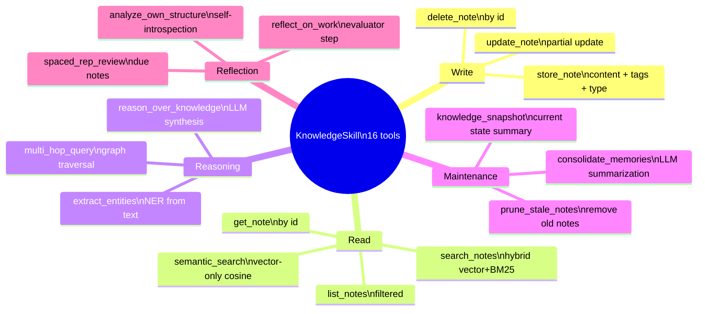
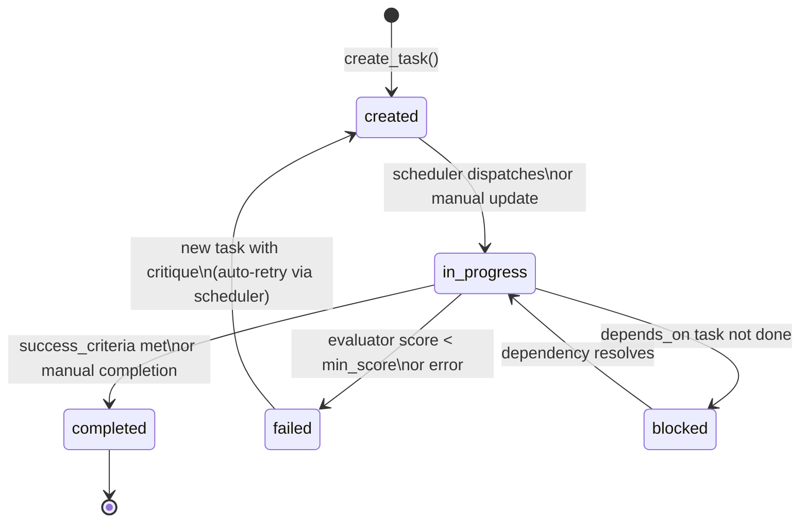
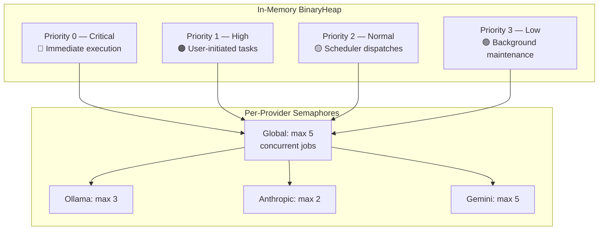
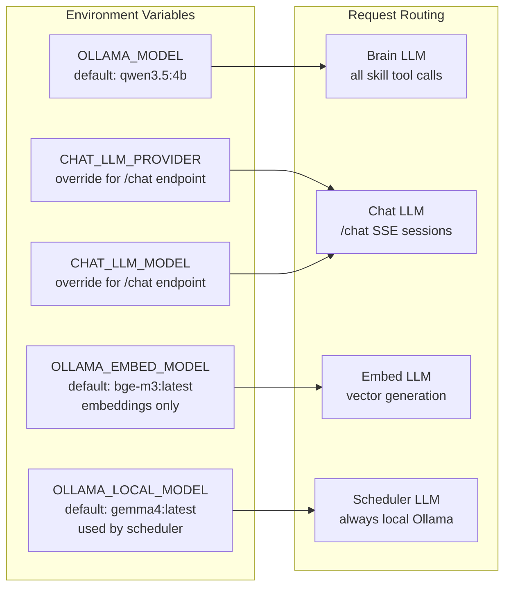

# Agent Brain — Skill & Tool Reference

## Tool Count Summary

| Skill | Tools | Purpose |
|-------|-------|---------|
| KnowledgeSkill | 16 | Store, search, reason over, and maintain long-term memory |
| CodebaseSkill | 7 | Read, search, and analyze source code |
| AgentSkill | 5 | Manage the background job queue |
| TaskSkill | 5 | Create and track goals with measurable outcomes |
| HttpSkill | 2 | Make HTTP requests with credential injection |
| ModelSkill | 2 | Manage and query the LLM model registry |
| SchedulerSkill | 4 | Control the autonomous scheduler loop |
| ContextSkill | 1 | Switch active context profiles |
| DynamicSkill | 3 | Define and manage runtime tools |
| WorkingMemorySkill | 2 | Session-scoped scratchpad storage |
| ProcedureSkill | 2 | Store and run multi-step workflows |
| SearchSkill | 1 | Web search via SerpAPI/Brave/Google |
| SleepSkill | 2 | Experience digestion and training data export |
| WsSkill | 4 | WebSocket connections |
| ResourceSkill | 1 | MCP resource exposure |
| **Dynamic tools** | N | Runtime-defined by AI or operator |
| **Total static** | **81+** | |

---

## Knowledge Skill — Tool Map

---

## Task Lifecycle

**Task Fields:**
| Field | Required | Description |
|-------|----------|-------------|
| `goal` | Yes | Plain-language objective |
| `context` | No | Constraints, background, critique from previous attempts |
| `success_criteria` | No | Measurable definition of done — triggers evaluator loop when set |
| `status` | Auto | created / in_progress / completed / failed / blocked |

---

## AgentJob Priority Queue

---

## Context Profile Comparison

| Profile | Key Tools Allowed | System Prompt Focus | Best For |
|---------|------------------|---------------------|----------|
| `general` | All tools | Balanced assistant | Default use |
| `knowledge-worker` | Knowledge + Working Memory | Memory-first reasoning | Research sessions |
| `task-manager` | Task + Agent + Scheduler | Goal decomposition | Project management |
| `code-analyst` | Codebase + Knowledge | Code review + analysis | Dev workflows |
| `api-builder` | HTTP + Dynamic + Procedure | API integration | Building integrations |
| `researcher` | Search + Knowledge + Reasoning | Information synthesis | Fact-finding |
| `scheduler` | All tools | Full autonomy | Unattended operation |

---

## LLM Provider Configuration

---

## Deployment Architecture Options

```mermaid
graph TB
    subgraph Option1["Option A: Local Dev (stdio)"]
        DEV_CLIENT[Claude Desktop\nor Cursor]
        DEV_BRAIN[Agent Brain process\nstdio MCP]
        DEV_NEO[Neo4j Docker :7688]
        DEV_OLL[Ollama :11434]
        DEV_CLIENT -->|spawn| DEV_BRAIN
        DEV_BRAIN --> DEV_NEO
        DEV_BRAIN --> DEV_OLL
    end

    subgraph Option2["Option B: Docker Compose (HTTP)"]
        PROD_CLIENT[Any HTTP Client\nor AI Frontend]
        PROD_BRAIN[Agent Brain container\nHTTP :3000]
        PROD_NEO[Neo4j container :7688]
        PROD_OLL[Ollama container :11434]
        PROD_CLIENT -->|Bearer auth| PROD_BRAIN
        PROD_BRAIN --> PROD_NEO
        PROD_BRAIN --> PROD_OLL
    end

    subgraph Option3["Option C: Cloud (external LLM)"]
        CLOUD_CLIENT[Web App / API Consumer]
        CLOUD_BRAIN[Agent Brain container\nHTTP :3000]
        CLOUD_NEO[Neo4j Aura\nor self-hosted]
        CLOUD_ANT[Anthropic API\nor Gemini API]
        CLOUD_CLIENT -->|HTTPS| CLOUD_BRAIN
        CLOUD_BRAIN --> CLOUD_NEO
        CLOUD_BRAIN -->|API key| CLOUD_ANT
    end
```

